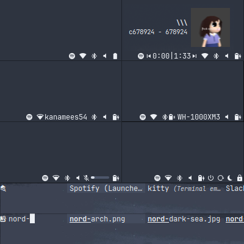

# Conf🍚

**Hyprland + i3 rice**🍙




## Install🤢

```bash
cp -r ~/.config ~/.config.bak # back up your configs
cp -r .config/* ~/.config     # copy the rice

echo 'ZDOTDIR=$HOME/.config/zsh' >> ~/.zshenv

# see below for dependencies
yay -S --needed hyprland hyprlock hypridle hyprpaper eww dunst ghostty \
    rofi-emoji rofi-wayland zsh zsh-autosuggestions zsh-syntax-highlighting \
    tmux neovim ripgrep fd grim slurp jq socat wtype wl-clipboard playerctl \
    brightnessctl pipewire networkmanager noto-fonts-emoji \
    ttf-jetbrains-mono-nerd

# and extra dependencies
yay -S --needed i3 xlockmore xdotool xclip autotiling picom alacritty kitty \
    maim btop feh neofetch fastfetch cava pipes.sh tty-clock cowsay nmtui \
    bluetui pulsemixer
```

### Keybinds🔑

See [hyprland.conf](./.config/hypr/hyprland.conf) or
[config](./.config/i3/config).

### Wallpapers🖼️

Hyprpaper tries to load `~/.cache/wallpaper` on startup. The
[wallpaper script](./.config/hypr/scripts/wallpaper.sh) looks for files in
`~/git/wallpapers`, activates the selected and saves it to cache.

### Dependencies📦

| package                 | description            |
| ----------------------- | ---------------------- |
| hyprland                | window manager         |
| hyprlock                | screen locker          |
| hypridle                | idle daemon            |
| hyprpaper               | wallpaper daemon       |
| eww                     | widgets (status bar)   |
| dunst                   | notification daemon    |
| ghostty                 | terminal emulator      |
| rofi-emoji              | emoji picker           |
| rofi-wayland            | application launcher   |
| zsh                     | shell                  |
| zsh-autosuggestion      | zsh suggestions        |
| zsh-syntax-highlighting | zsh syntax highlight   |
| tmux                    | terminal multiplexer   |
| neovim                  | text editor            |
| ripgrep                 | grep (nvim telescope)  |
| fd                      | find (nvim telescope)  |
| grim                    | screenshot tool        |
| slurp                   | screen grab tool       |
| jq                      | json processor         |
| socat                   | socket cat             |
| wtype                   | wayland paste tool     |
| wl-clipboard            | wayland clipboard tool |
| playerctl               | audio player control   |
| brightnessctl           | backlight control      |
| pipewire                | audio control          |
| networkmanager          | networking             |
| noto-fonts-emoji        | emoji font             |
| ttf-jetbrains-mono-nerd | font and icons         |

### Extra dependencies✨

| package    | description             |
| ---------- | ----------------------- |
| i3         | x11 window manager      |
| xlockmore  | x11 screen locker       |
| xdotool    | x11 paste tool          |
| xclip      | x11 clipboard tool      |
| autotiling | i3 automatic tiling     |
| picom      | compositor              |
| feh        | wallpaper utility       |
| maim       | screenshot tool         |
| alacritty  | terminal emulator       |
| kitty      | terminal emulator       |
| btop       | monitoring tool         |
| fastfetch  | system info fetcher     |
| neofetch   | system info fetcher     |
| cava       | audio screensaver       |
| pipes.sh   | pipes screensaver       |
| tty-clock  | clock screensaver       |
| cowsay     | cow sayer               |
| nmtui      | networkmanager frontend |
| bluetui    | bluetoothctl frontend   |
| pulsemixer | pipewire frontend       |
