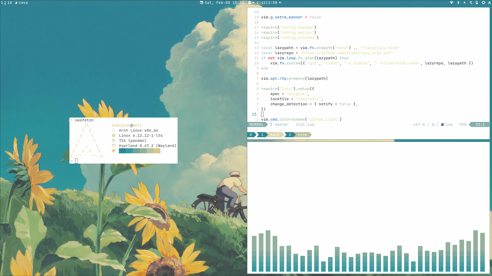
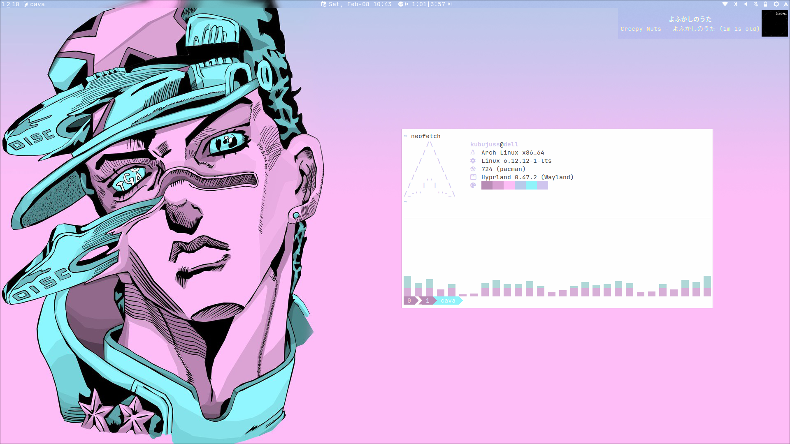
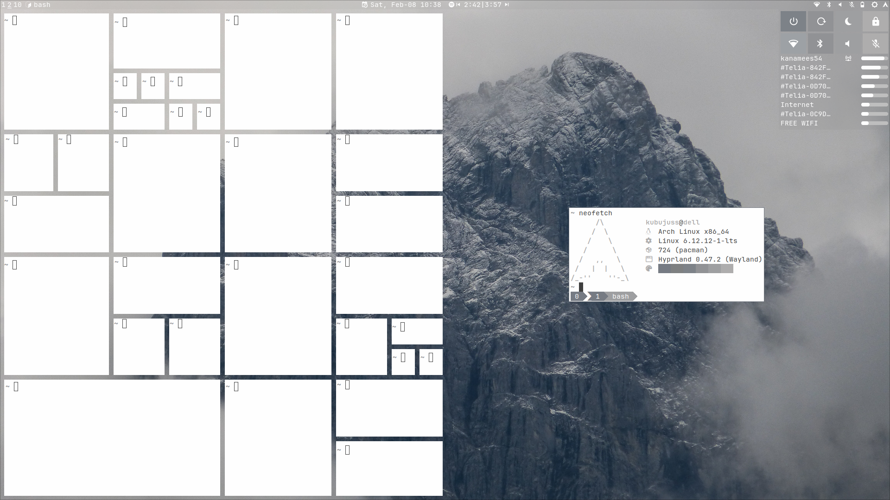

# 🍚Conf - Hyprland rice





## Install🤢

```bash
cp -r .config/* ~/.config
cp .tmux.conf ~/.tmux.conf
cp .bashrc ~/.bashrc
```

### Programs✨

**hyprland**

| program   | description      |
| --------- | ---------------- |
| hyprland  | window manager   |
| hyprlock  | screen locker    |
| hypridle  | idle daemon      |
| hyprpaper | wallpaper daemon |

**apps**

| program      | description          |
| ------------ | -------------------- |
| eww          | widgets (status bar) |
| dunst        | notification daemon  |
| alacritty    | terminal emulator    |
| rofi-emoji   | emoji picker         |
| rofi-wayland | application launcher |

**shell**

| program   | description          |
| --------- | -------------------- |
| bash      | shell                |
| tmux      | terminal multiplexer |
| neovim    | text editor          |
| fastfetch | system info fetcher  |

### Dependencies📦

**tools**

| tool                          | description                    |
| ----------------------------- | ------------------------------ |
| socat                         | socket cat                     |
| expect                        | interactive scripting tool     |
| pywal-16                      | colorscheme generator          |
| playerctl                     | audio player control           |
| grim & slurp                  | screenshot tools               |
| wl-clipboard                  | clipboard tool                 |
| inotify-tools                 | monitor filesystem events      |
| brightnessctl                 | backlight control              |
| networkmanager                | networking                     |
| wayland-pipewire-idle-inhibit | automatic audio idle inhibitor |

**fonts**

| tool                    | description    |
| ----------------------- | -------------- |
| noto-fonts-emoji        | emoji font     |
| ttf-jetbrains-mono-nerd | font and icons |
