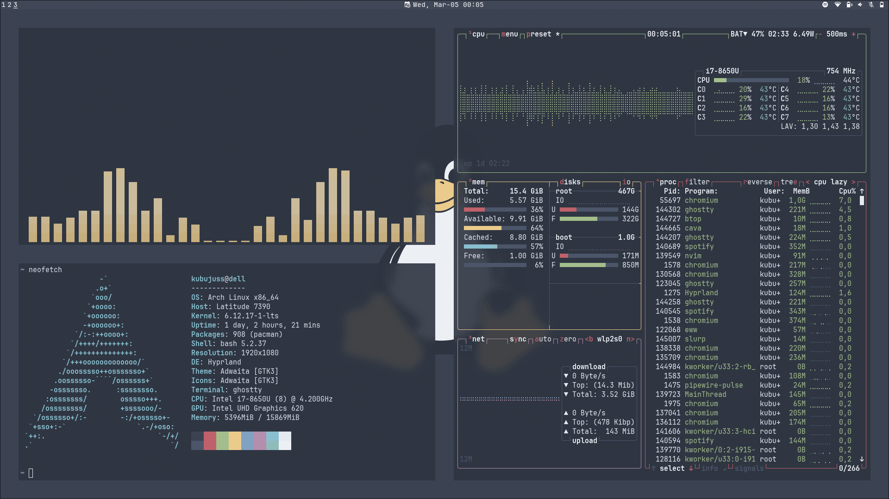

# Conf🍚

**Hyprland rice**



## Install🤢

```bash
# back up your configs beforehand
cp -r .config/* ~/.config
cp .tmux.conf ~/.tmux.conf
cp .bashrc ~/.bashrc

# see below for dependencies
yay -S hyprland hyprlock hypridle hyprpaper eww dunst kitty rofi-emoji rofi-wayland bash tmux nmtui neovim bluetui pulsemixer socat wtype playerctl grim wl-clipboard brightnessctl networkmanager wayland-pipewire-idle-inhibit noto-fonts-emoji tf-jetbrains-mono-nerd
```

For hyprpaper to work your wallpaper should be in `~/.cache/wallpaper`

## Dependencies📦

| package                 | description             | required |
| ----------------------- | ----------------------- | -------- |
| hyprland                | window manager          | ✔        |
| hyprlock                | screen locker           |          |
| hypridle                | idle daemon             |          |
| hyprpaper               | wallpaper daemon        | ✔        |
| eww                     | widgets (status bar)    | ✔        |
| dunst                   | notification daemon     | ✔        |
| kitty                   | terminal emulator       | ✔        |
| rofi-emoji              | emoji picker            |          |
| rofi-wayland            | application launcher    | ✔        |
| fzf                     | fuzzy finder            |          |
| bash                    | shell                   |          |
| tmux                    | terminal multiplexer    |          |
| neovim                  | text editor             |          |
| nmtui                   | networkmanager frontend |          |
| bluetui                 | bluetooth frontend      |          |
| pulsemixer              | audio control frontend  |          |
| grim                    | screenshot tool         |          |
| slurp                   | screenshot tool         |          |
| socat                   | socket cat              | ✔        |
| wtype                   | wayland paste tool      |          |
| wl-clipboard            | wayland clipboard tool  |          |
| playerctl               | audio player control    | ✔        |
| brightnessctl           | backlight control       | ✔        |
| networkmanager          | networking              | ✔        |
| noto-fonts-emoji        | emoji font              |          |
| ttf-jetbrains-mono-nerd | font and icons          | ✔        |
