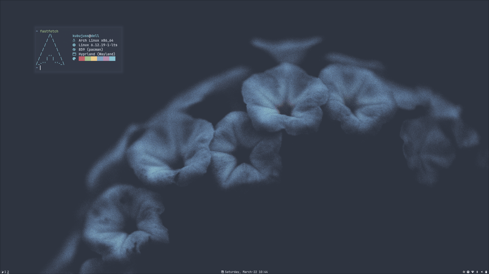
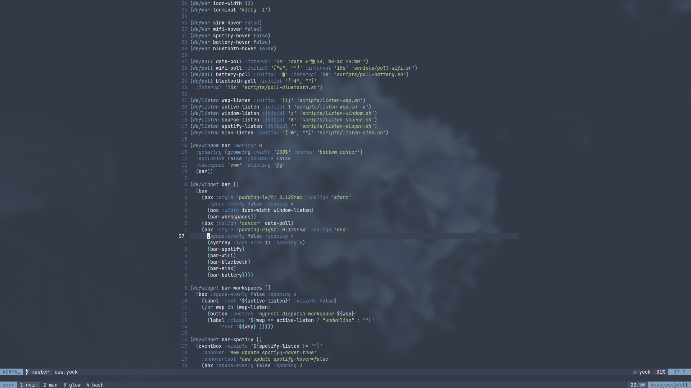
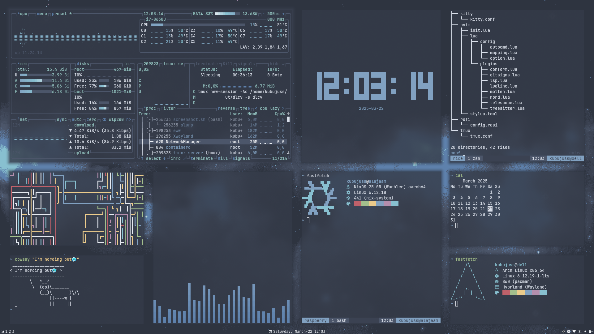
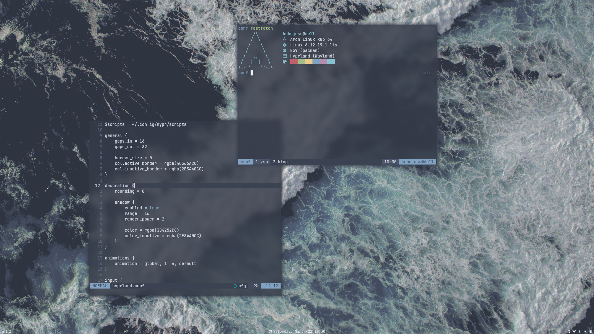
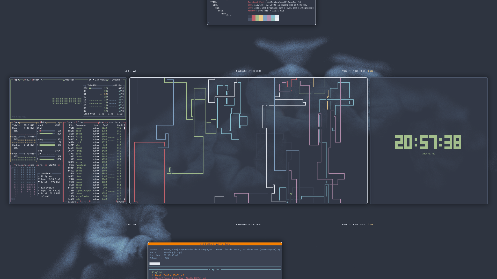
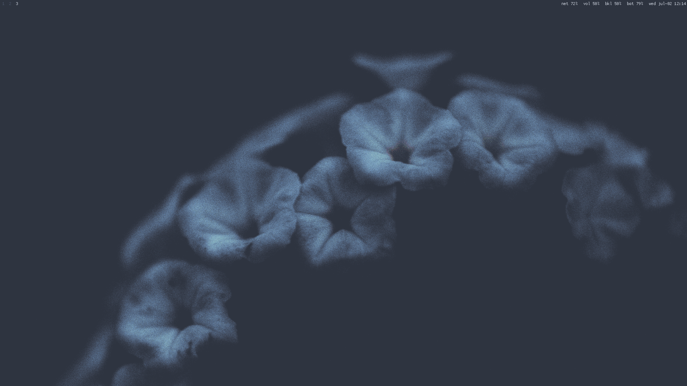
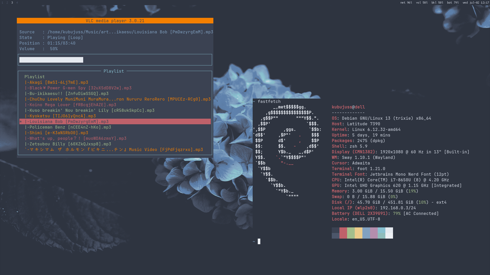
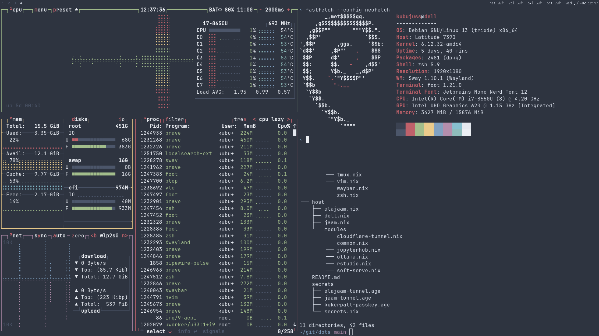
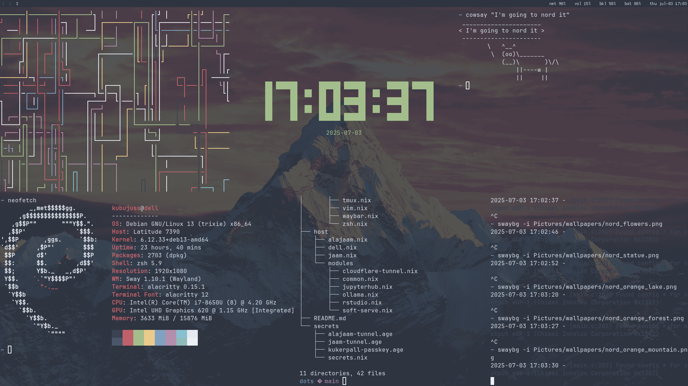

# Conf

Dotfiles and setup script for debian trixie, run `install-debian.sh`

Configs of old rices are on their respective branches

**Hyprland**

|||
|-------------------------------------|-----------------------------------|
|    |      |

**Niri**

**Sway**

||    |
|--------------------------------------|----------------------------------------|
|    ||
