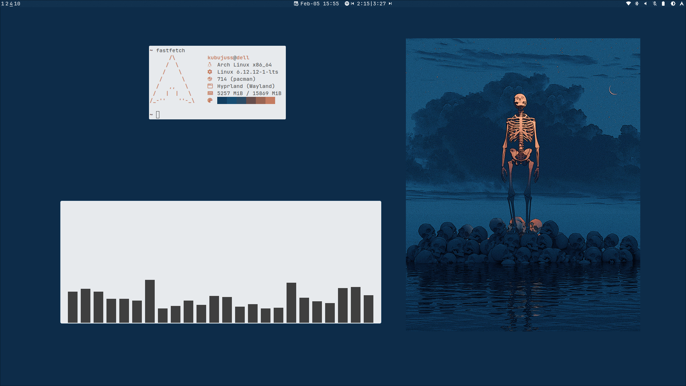

# conf 🍚





## Install

```bash
cp -r .config/* ~/.config
cp .tmux.conf ~/.tmux.conf
cp .bashrc ~/.bashrc
```

## Dependencies

- hyprland: `hyprland hyprlock hypridle hyprpaper`
- apps: `alacritty dunst eww rofi-wayland rofi-emoji`
- shell: `neovim tmux bash ripgrep`
- color: `pywal-16 gammastep`
- tools: `brightnessctl playerctl grim slurp inotify-tools expect socat wl-clipboard gvfs networkmanager pipewire-pulse`
- fonts: `ttf-jetbrains-mono-nerd noto-fonts-emoji`
