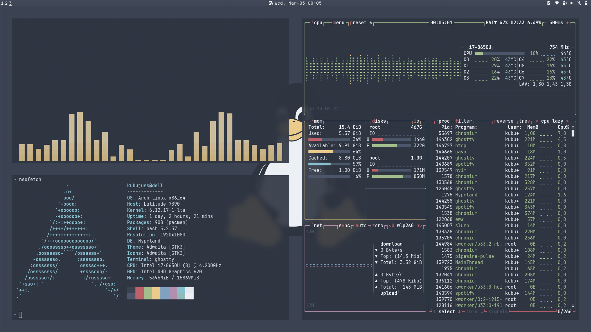

# Conf🍚

**i3 rice**



## Install🤢

```bash
# back up your configs beforehand
cp -r .config/* ~/.config
cp .tmux.conf ~/.tmux.conf
cp .xinitrc ~/.xinitrc
cp .bashrc ~/.bashrc

# see below for dependencies
yay -S i3 i3blocks feh dunst kitty rofi-emoji rofi bash tmux nmtui neovim bluetui pulsemixer maim xclip xdotool playerctl brightnessctl networkmanager noto-fonts-emoji tf-jetbrains-mono-nerd
```

For wallpaper to work your wallpaper should be a file called `~/.cache/wallpaper`

## Dependencies📦

| package                 | description             | required |
| ----------------------- | ----------------------- | -------- |
| i3                      | window manager          | ✔        |
| i3blocks                | status bar              | ✔        |
| picom                   | compositor              | ✔        |
| feh                     | wallpaper daemon        | ✔        |
| dunst                   | notification daemon     | ✔        |
| kitty                   | terminal emulator       | ✔        |
| rofi-emoji              | emoji picker            |          |
| rofi                    | application launcher    | ✔        |
| fzf                     | fuzzy finder            |          |
| bash                    | shell                   |          |
| tmux                    | terminal multiplexer    |          |
| neovim                  | text editor             |          |
| nmtui                   | networkmanager frontend |          |
| bluetui                 | bluetooth frontend      |          |
| pulsemixer              | audio control frontend  |          |
| maim                    | screenshot tool         |          |
| xclip                   | x11 clipboard tool      |          |
| xdotool                 | x11 paste tool          |          |
| playerctl               | audio player control    | ✔        |
| brightnessctl           | backlight control       | ✔        |
| networkmanager          | networking              | ✔        |
| noto-fonts-emoji        | emoji font              |          |
| ttf-jetbrains-mono-nerd | font and icons          | ✔        |
